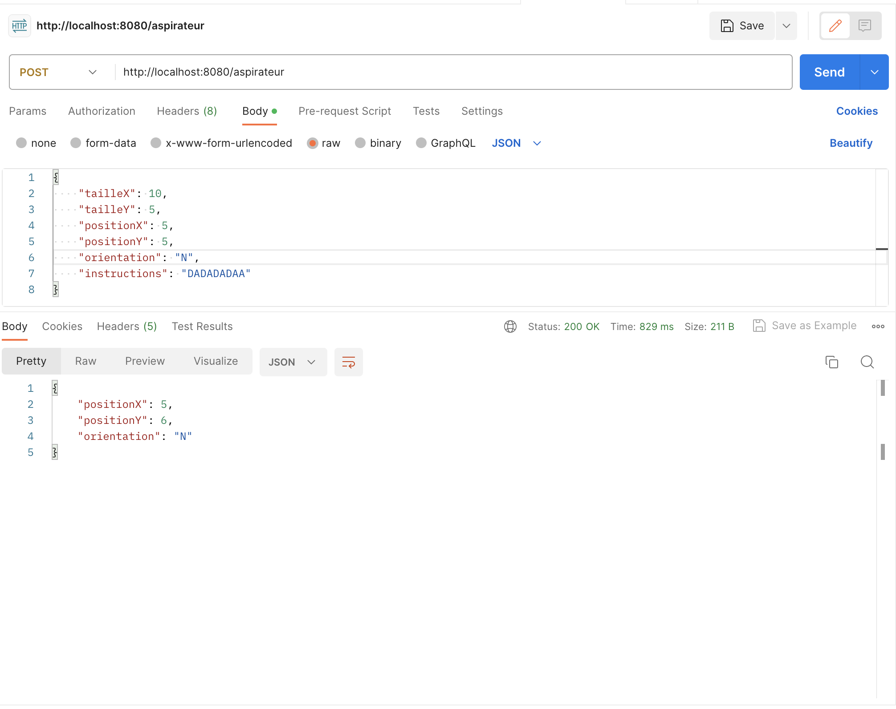

# yanport install

 `gradle clean`

# yanport run

`./gradlew bootRun`

# yanport test to postman

    -- server http://localhost
    -- port : 8080
    -- type request: POST
    -- path "/aspirateur
    -- body : json

# yanport illustration

    

    
   

# Next test with gatling inprogress mode
................................................................